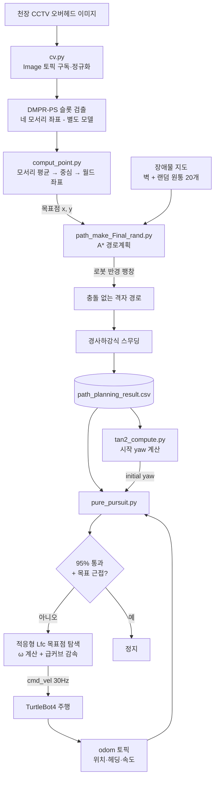

# Physical_AI_ws

> 오버헤드 CCTV로 목표 지점을 인지하고, A\*로 경로를 생성한 뒤, Pure Pursuit로 로봇을 그 경로에 실어 보낸다. 인지·계획·제어 세 단계를 하나의 자율주행 파이프라인으로 ROS 2 위에서 통합·검증한 프로젝트다.


---

## 🎯 프로젝트 소개

**천장 CCTV 한 대로 물류 공간의 목표 지점(예: 적재/주차 슬롯)을 인식하고, 그 좌표를 향해 자율 로봇이 장애물을 피해 도달하기까지의 전 과정을 인지 → 경로계획 → 제어 세 모듈로 나눠 구현한 뒤, TurtleBot4와 Gazebo 시뮬레이션 위에서 통합 동작을 검증한 프로젝트다.** 쿠팡 물류센터형 시나리오(정적 장애물이 배치된 구조화된 실내 공간에서의 자율 주행)를 대상으로 삼았다.

로봇에 별도의 라이다 SLAM을 얹는 대신, 이미 설치된 천장 카메라(Top-Down 시점)를 인지 센서로 활용한다. 위에서 내려다본 한 장의 이미지에서 목표 슬롯의 네 모서리를 검출해 중심 좌표를 구하고, 이 좌표를 목적지로 삼아 A\* 경로를 생성한 다음, Pure Pursuit 제어기가 생성된 경로를 추종한다.

- 🧭 **인지 → 계획 → 제어 단일 파이프라인**: 세 모듈이 좌표 하나(목표 지점)를 매개로 직렬 연결된다.
- 🗺 **Top-Down 인지**: 오버헤드 카메라 이미지의 픽셀 좌표를 월드 좌표(20m × 20m 평면)로 변환해 목표점을 산출한다.
- 🚗 **차체 크기를 반영한 A\***: 로봇 반경만큼 장애물을 팽창(padding)시켜 충돌 없는 경로를 생성한다.
- 🎯 **속도 연동 Pure Pursuit**: 전방 주시 거리(Lfc)를 속도에 비례시키고, 급커브에서 선속도를 자동 감속한다.
- 🤖 **ROS 2 통합**: 오도메트리 구독, `cmd_vel` 발행, CSV 경로 로딩까지 실제 TurtleBot4 토픽 구조로 동작한다.

---

## 🧩 풀어야 했던 문제

자율주행 알고리즘은 한 환경에서 한 번 성공했다고 해서 다른 환경에서도 안정적으로 동작한다고 보장할 수 없다. 특히 물류센터 같은 실내 공간은 장애물이 정적이더라도 공간 구조가 장소마다 다르다. 따라서 요구되는 것은 "특정 맵에서의 성공"이 아니라 **다양한 정적 배치에서도 반복적으로 목표에 도달하는 능력**이었다.

이를 검증하려면 인지·계획·제어를 각각 만드는 것으로는 부족하고, 세 모듈이 하나의 좌표계를 공유하며 끊김 없이 이어지는 통합 파이프라인이 필요했다. 구체적으로 세 가지 지점에서 통합의 어려움이 발생했다.

1. **인지 → 계획 좌표 정합**: 카메라가 보는 것은 픽셀 좌표이고, 경로계획기가 다루는 것은 월드 좌표다. 두 좌표계를 하나로 맞추지 못하면 목표점이 어긋난다.
2. **계획 단계의 충돌**: 초기 A\*는 로봇을 점으로 가정해 경로를 뽑아, 차체 폭 때문에 실제로는 장애물에 부딪혔다.
3. **계획 → 제어 좌표 정합**: 경로 CSV는 월드 좌표(시작점 -6, -6)로 저장되지만, 로봇의 오도메트리 프레임은 원점에서 특정 방향을 향한 채 시작한다. 이 둘을 정렬하지 않으면 로봇이 경로를 엉뚱한 방향으로 추종한다.

이 세 가지를 각각 좌표 변환·장애물 팽창·프레임 정렬로 해결한 것이 이 저장소의 핵심 작업이다.

---

## 🧠 접근 방법

### 1. 인지 (Perception) — 오버헤드 CCTV로 목표점 추출

- **CCTV 이미지 브리징 (`turtlebot4_ws/cv.py`)**: `/overhead_camera/image` 토픽을 구독하는 ROS 2 노드. `mono16`으로 들어오는 천장 카메라 이미지를 `cv_bridge`로 받아 8비트로 정규화(`cv2.normalize`)해 시각화한다. 시뮬레이터의 오버헤드 카메라를 OpenCV/RViz 계열로 끌어오는 연결 지점 역할을 한다.
- **목표점 좌표 변환 (`compute_avg_point/comput_point.py`)**: 검출된 슬롯의 네 모서리 픽셀 좌표를 입력받아 평균(중심)을 구한 뒤, 이미지 전체를 월드 좌표로 매핑한다. 좌상단 픽셀 (0, 0)을 월드 (10, 10), 우하단 (W, H)를 월드 (-10, -10)에 대응시켜, 검출된 중심 픽셀을 경로계획기가 그대로 쓸 수 있는 월드 목표 좌표로 환산한다. 이 20m × 20m 좌표계는 뒤이은 A\* 격자와 동일하다.
- 슬롯 모서리 검출에는 DMPR-PS(Directional Marking-Point Regression) 기반 주차 슬롯 검출을 사용했다. 시뮬레이터 환경에서는 사전학습 가중치의 성능이 떨어져, MATLAB으로 직접 라벨링한 데이터셋을 만들고 데이터 증강을 적용해 Full Fine-tuning을 진행했다. (검출 모델의 학습 코드·가중치는 별도이며 이 저장소에는 포함되지 않는다. 이 저장소는 카메라 이미지 수신과 좌표 변환 등 인지 결과를 파이프라인에 잇는 부분을 담는다.)

### 2. 경로계획 (Planning) — 차체 크기를 반영한 A\*

`turtlebot4_ws/src/control_pkg/control_pkg/path_make_Final_rand.py` 에 구현했다.

- **격자·휴리스틱**: 20m × 20m 공간을 0.1m 격자로 이산화하고, 8방향 이동 모델(상하좌우 비용 1, 대각선 비용 √2)과 유클리드 거리 휴리스틱, `heapq` 우선순위 큐로 A\*를 구성했다. 평가 함수는 `f(n) = g(n) + h(n)`이다.
- **차체 크기 반영**: 로봇 반경(`ROBOT_RADIUS = 0.6m`)만큼 각 장애물 셀을 사방으로 팽창시켜 장애물 지도를 만든다. 로봇을 점이 아니라 반경을 가진 원으로 취급해, 초기 버전에서 발생하던 차체-장애물 충돌을 경로 단계에서 제거했다.
- **환경 구성**: 시작점 (-6, -6)에서 목표점 (0, 7)까지, 경계벽 + 주차구역 고정 블록 2개 + 2m 벽 4개(A~D) + 랜덤 원통 장애물 20개로 이루어진 맵에서 경로를 탐색한다. 랜덤 장애물 배치로 "다양한 정적 환경"을 흉내 낸다.
- **경로 평탄화**: A\*의 격자 경로는 계단형이라 그대로 추종하면 진동이 생긴다. 원본 경로에 대한 근접 항(α)과 이웃 평균으로의 이동 항(β)을 100회 반복하는 경사하강식 스무딩을 적용해 부드러운 경로로 다듬는다.
- **출력**: 결과 경로를 `path_planning_result.csv`(약 137개 waypoint)와 `.png` 시각화로 저장한다. 이 CSV가 제어 모듈의 입력이 된다.

### 3. 제어 (Control) — 속도 연동 Pure Pursuit

`turtlebot4_ws/src/control_pkg/control_pkg/pure_pursuit.py` 의 ROS 2 노드로 구현했다.

- **경로 로딩과 프레임 정렬**: CSV 경로를 읽어 시작점을 오도메트리 원점(0, 0)으로 평행이동하고, 시작 방향(yaw)만큼 역회전시켜 로봇의 오도메트리 프레임에 정렬한다. 시작 yaw는 경로 첫 두 점의 방향에서 계산하며, `tan2_compute.py`가 `atan2(Y1-Y0, X1-X0)`로 이 값을 산출한다.
- **적응형 전방 주시 거리(Lfc)**: `Lfc = Lfc_base + K·|v|` 로 속도에 비례시키되 최대값(2.0m)으로 제한한다. 경로 끝 구간(90% 이후)에서는 Lfc를 최소값까지 선형 감소시켜 목표 근처에서의 오버슈트를 줄인다.
- **조향 계산**: 가장 가까운 경로점을 추적하고 그 앞에서 Lfc를 넘어서는 첫 목표점을 찾은 뒤, Pure Pursuit 공식 `ω = 2·v·sin(α) / Lfc`로 각속도를 계산한다(α = 목표점 방향과 현재 헤딩의 차). 각속도는 최대 1.5 rad/s로 클램프한다.
- **급커브 감속(V-Omega 연동)**: 각속도가 클수록 선속도를 낮춘다. `v = TARGET_SPEED·(1 - K_OMEGA·|ω|/ω_max)`로, 급하게 꺾을 때 속도를 줄여 Pure Pursuit의 약점인 코너 진동을 완화한다.
- **종료 조건**: 경로의 95% 이상을 지나고 최종 목표점과 충분히 가까워지면(`Lfc_base`의 절반 이내) 정지 명령을 내고 타이머를 해제한다. 노드 종료 시에도 안전 정지 명령을 발행한다.
- **ROS 인터페이스**: `odom`(Odometry) 구독으로 현재 위치·헤딩·선속도를 갱신하고, 30Hz 제어 루프에서 `cmd_vel`(TwistStamped)을 발행한다.

---

## 🛠 기술 스택

| 구분 | 사용 기술 |
|---|---|
| **로봇·미들웨어** | ROS 2 (ament_python, package format 3), TurtleBot4 |
| **시뮬레이션** | Gazebo (SDF 1.10 월드), RViz |
| **언어** | Python 3 |
| **인지** | OpenCV, cv_bridge, DMPR-PS 기반 슬롯 검출(별도 학습), MATLAB(데이터 라벨링) |
| **경로계획** | A\* (heapq, 8방향 모델), 경사하강식 경로 스무딩, NumPy, Matplotlib |
| **제어** | Pure Pursuit, tf_transformations(쿼터니언→yaw), 적응형 Lfc, V-Omega 감속 |
| **메시지** | sensor_msgs/Image, nav_msgs/Odometry, geometry_msgs/TwistStamped |
| **데이터 연동** | pandas, CSV(경로 waypoint 교환) |

> 인지·계획·제어 모듈은 ROS 토픽과 CSV 파일을 매개로 느슨하게 결합되어 있어, 각 단계를 독립적으로 교체·재실행하며 실험할 수 있다.

---

## 📁 저장소 구조

```
Physical_AI_ws/
├── compute_avg_point/
│   ├── comput_point.py          # 슬롯 4모서리 → 중심 → 월드 좌표 변환 (인지→계획 브리지)
│   └── map.jpg                   # 좌표 변환 대상 오버헤드 이미지
├── route/
│   ├── path_planning_result.csv # A* 생성 경로 (약 137 waypoint, 제어 입력)
│   └── path_planning_result.png # 경로 시각화
└── turtlebot4_ws/               # ROS 2 워크스페이스
    ├── cv.py                     # /overhead_camera/image 구독·시각화 (CCTV 브리징)
    ├── src/control_pkg/          # 핵심 계획·제어 패키지 (ament_python)
    │   └── control_pkg/
    │       ├── path_make_Final_rand.py  # A* 경로계획 + 스무딩 (오프라인 스크립트)
    │       ├── pure_pursuit.py          # Pure Pursuit 제어 ROS 노드
    │       └── tan2_compute.py          # 경로 시작 yaw 계산
    ├── src/turtlebot4_python_tutorials/ # TurtleBot4 튜토리얼 스캐폴드
    └── worlds_nouse/             # Gazebo 주차 월드 3종 (기본·전진·후진)
```

**저장소 범위(정직성)**: 이 저장소는 파이프라인을 잇는 통합 코드를 담는다. 인지 쪽에서는 카메라 이미지 수신(`cv.py`)과 목표 좌표 변환(`comput_point.py`)이, 계획 쪽에서는 A\* 플래너가, 제어 쪽에서는 Pure Pursuit 노드가 여기에 있다. DMPR-PS 검출 모델의 학습 코드와 가중치는 별도이며 포함되어 있지 않다. `path_make_Final_rand.py`는 CSV를 생성하는 오프라인 스크립트로 동작하고, `pure_pursuit.py`가 그 CSV를 소비하는 온라인 ROS 노드다.

---

## 🏗 동작 흐름



**핵심 구조 포인트**

- **세 모듈을 잇는 것은 좌표 하나다.** 인지가 뽑은 월드 목표 좌표가 A\*의 goal이 되고, A\*가 뽑은 CSV가 Pure Pursuit의 참조 경로가 된다. 모듈 간 결합을 좌표계와 파일로 단순화해 각 단계를 따로 검증할 수 있게 했다.
- **좌표계 정합이 통합의 관건이다.** 픽셀→월드 변환(인지→계획)과 월드→오도메트리 프레임 정렬(계획→제어)이라는 두 번의 좌표 변환이 파이프라인 정확도를 좌우한다.
- **제어는 오프라인/온라인을 분리한다.** 경로는 미리 생성해 CSV로 고정하고(오프라인), 제어 노드는 실시간 오도메트리만 받아 그 경로를 추종한다(온라인). 재현성과 반복 실험을 확보하기 위한 선택이다.

---

## 🐛 로컬 실행

전제: ROS 2 + TurtleBot4 시뮬레이션(Gazebo) 환경, `cv_bridge`, `tf_transformations`, `pandas`, `numpy`, `matplotlib`, `opencv-python`.

```bash
# 1) 인지: 오버헤드 카메라 이미지 확인 (시뮬레이터 실행 상태에서)
python3 turtlebot4_ws/cv.py

# 2) 인지→계획 브리지: 검출된 슬롯 모서리의 중심을 월드 목표 좌표로 변환
python3 compute_avg_point/comput_point.py

# 3) 계획: A*로 경로 생성 → path_planning_result.csv / .png 저장
python3 turtlebot4_ws/src/control_pkg/control_pkg/path_make_Final_rand.py

# 4) (선택) 경로 시작 yaw 확인
python3 turtlebot4_ws/src/control_pkg/control_pkg/tan2_compute.py

# 5) 제어: ROS 2 워크스페이스 빌드 후 Pure Pursuit 노드 실행
cd turtlebot4_ws
colcon build --packages-select control_pkg
source install/setup.bash
ros2 run control_pkg pure_pursuit --ros-args -p csv_path:=/path/to/route/path_planning_result.csv
```

`path_make_Final_rand.py`의 시작점·목표점·장애물 좌표, `pure_pursuit.py`의 제어 파라미터(`TARGET_SPEED`, `MAX_OMEGA`, `Lfc_base`, `RATE` 등)와 CSV 경로는 코드 상단 상수 또는 ROS 파라미터로 조정한다.

---

## 👤 팀 · 역할

3인 팀 프로젝트. 실험 기간 2025.11 ~ 12(약 3주).

| 이름 | 역할 | 담당 |
|---|---|---|
| **김재현** (팀장) | 인지 · 판단 · 제어 통합 | 파이프라인 통합, 좌표 변환, A\* 경로계획, Pure Pursuit 제어 |
| **박찬일** | 인지 | 슬롯 검출·인지 모듈 |
| **송재민** | 판단 | 경로계획·판단 모듈 |

---

## 🔗 참고

- 실행 영상 및 상세 기록: [Blog](https://blog.naver.com/deoduck92/224211977269)
- Huang et al., *DMPR-PS: Parking-Slot Detection Using Directional Marking-Point Regression*, IEEE T-ITS, 2021
- Dan Xiang et al., *Combined improved A\* and greedy algorithm for path planning of multi-objective mobile robot*, Scientific Reports, vol. 12, 2022
- *Pure pursuit 알고리즘 기반 모바일 로봇의 경로 추종 성능 분석*, ScienceON, 2022
- Ahn et al., *Accurate Path Tracking by Adjusting Control Gains*, IEEE Access, 2021
</content>
</invoke>
